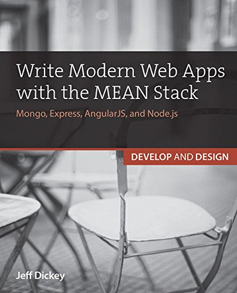

Sample project for [Write Modern Web Apps with the MEAN Stack] by [Jeff Dickey]

[]

Chapters
--------

* Chapter 1: How Modern Web Architecture Is Changing
* Chapter 2: Why JavaScript Is a Good Choice for Modern Apps
* Chapter 3: Introducing the Social Networking Projectd
* Chapter 4: Building a Node.js API
* Chapter 5: Integrating Node with Angular lu
* Chapter 6: Automating Your Build with Gulp
* Chapter 7: Building Authentication in Node.js
* Chapter 8: Adding Routing and Client Authentication 
* Chapter 9: Pushing Notifications with WebSockets 
* Chapter 10: Performing End-to-End Testing
* Chapter 11: Testing the Node Server 
* Chapter 12: Testing Angular.js 
* Chapter 13: Deploying to Heroku
* Chapter 14: Deploying to Digital Ocean

**If you see anything that is confusing, seems like a step is skipped, or that is different from the book than here, please [submit an issue] I want to make sure this code is as helpful as possible and should get back to you quickly.**

Changeaj e5ks
-------

Express res.send -> res.sendStatus
----------------------------------

Express deprecated the syntax for simple HTTP responses. You used to be able to say `res.send(401)` and it would reply 'Unauthorized' along with the HTTP code, this is deprecated in favor of `res.sendStatus(401)` which does the same thing.
